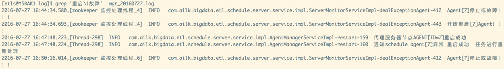
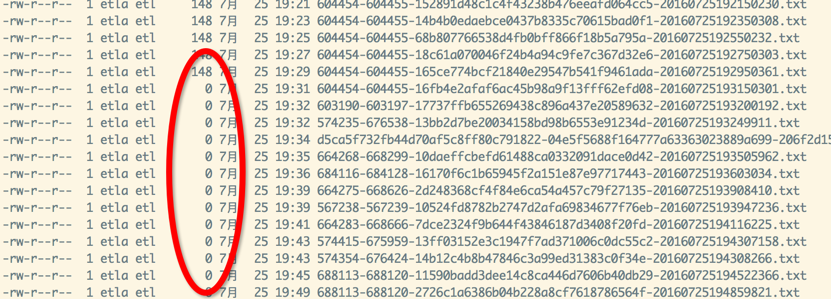

# 6.关于2016.07.27北京移动165节点故障的原因分析

> 问题描述：165agent节点部分任务状态异常。

### a.原因分析：
	最终zk断连的原因定位为，部分job的过程文件生成为空，导致部分线程死循环，最终导致zk线程消息发不出去。
##### 1.查看server端日志：
```bash
grep '重启\|故障'  mgr_20160727.log
```
 
##### 2.AGENT网络正常，但CPU很高：
165节点cpu一直很高，2000%以上［32核］
 

	持续高最终结果就是 agent 和zk断连［zk线程无法发送消息给zk集群］，server在agent断连会挂起该agent上所有JOB。
	部分JOB配置失败告警，因此客户有感知。

### b.解决办法：
##### 1.查看java中的线程，找出占cpu高的线程： 
```bash
ps mp 5953 -o THREAD,tid
```
`将cpu高的线程ID记录下来，将该ID转换成16进制`

##### 2.打印java进程的堆栈：
```bash
jstack 4953 
```
查看该线程位置［线程忙除了死锁外，基本上可以认为程序逻辑有问题，如死循环］：
 

##### 3.排查程序发现以下部分逻辑问题，进入死循环：
###### (1).如果node结果文件内容为空：
ResultMonitorThread  84行
 

###### (2).processid文件为空：
NodeRunServiceImpl.getProcessId 806行
 


------------------------------------------------------------
程序为什么或什么情况会有空文件，还需要继续定位［可能的情况有运行程序执行挂起操作等］
考虑到不能随意启停agent，可以暂时通过手动写内容到文件中，使线程退出循环。
 
 
因此维护在cpu高的情况下 要重点监控下  tmp 目录下的process文件  和runlog下的 空文件，如果发现有空文件，确认问题后手工处理掉。